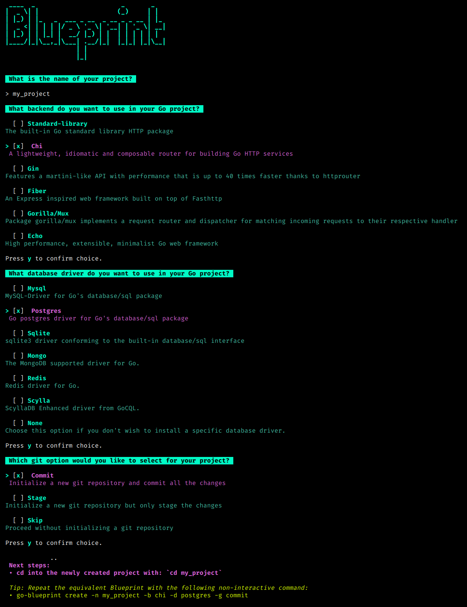
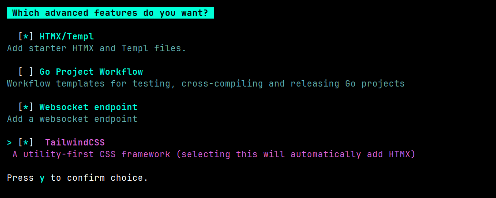

<div style="text-align: center;">
  <h1>
    Introducing the Ultimate Golang Blueprint Library
  </h1>
</div>

Go Blueprint is a CLI tool that allows users to spin up a Go project with the corresponding structure seamlessly. It also
gives the option to integrate with one of the more popular Go frameworks (and the list is growing with new features)!

### Why Would I use this?

- Easy to set up and install
- Have the entire Go structure already established
- Setting up a Go HTTP server (or Fasthttp with Fiber)
- Integrate with a popular frameworks
- Focus on the actual code of your application

## Table of Contents

- [Install](#install)
- [Frameworks Supported](#frameworks-supported)
- [Database Support](#database-support)
- [Advanced Features](#advanced-features)
- [Blueprint UI](#blueprint-ui)
- [Usage Example](#usage-example)
- [GitHub Stats](#github-stats)
- [License](#license)

<a id="install"></a>

<h2>
  <picture>
    
  </picture>
  Install
</h2>

```bash
go install github.com/melkeydev/go-blueprint@latest
```

This installs a go binary that will automatically bind to your $GOPATH

> if you’re using Zsh, you’ll need to add it manually to `~/.zshrc`.

```bash
GOPATH=$HOME/go  PATH=$PATH:/usr/local/go/bin:$GOPATH/bin
```

don't forget to update

```bash
source ~/.zshrc
```

Then in a new terminal run:

```bash
go-blueprint create
```

You can also use the provided flags to set up a project without interacting with the UI.

```bash
go-blueprint create --name my-project --framework gin --driver postgres --git commit
```

See `go-blueprint create -h` for all the options and shorthands.

<a id="frameworks-supported"></a>

<h2>
  <picture>
    
  </picture>
  Frameworks Supported
</h2>

- [Chi](https://github.com/go-chi/chi)
- [Gin](https://github.com/gin-gonic/gin)
- [Fiber](https://github.com/gofiber/fiber)
- [HttpRouter](https://github.com/julienschmidt/httprouter)
- [Gorilla/mux](https://github.com/gorilla/mux)
- [Echo](https://github.com/labstack/echo)

<a id="database-support"></a>

<h2>
  <picture>
    
  </picture>
  Database Support
</h2>

Go Blueprint now offers enhanced database support, allowing you to choose your preferred database driver during project setup. Use the `--driver` or `-d` flag to specify the database driver you want to integrate into your project.

### Supported Database Drivers

Choose from a variety of supported database drivers:

- [Mysql](https://github.com/go-sql-driver/mysql)
- [Postgres](https://github.com/jackc/pgx/)
- [Sqlite](https://github.com/mattn/go-sqlite3)
- [Mongo](https://go.mongodb.org/mongo-driver)
- [Redis](https://github.com/redis/go-redis)
- [ScyllaDB GoCQL](https://github.com/scylladb/gocql)

<a id="advanced-features"></a>

<h2>
  <picture>
    
  </picture>
  Advanced Features
</h2>

Blueprint is focused on being as minimalistic as possible. That being said, we wanted to offer the ability to add other features people may want without bloating the overall experience.

You can now use the `--advanced` flag when running the `create` command to get access to the following features. This is a multi-option prompt; one or more features can be used at the same time:

- [HTMX](https://htmx.org/) support using [Templ](https://templ.guide/)
- CI/CD workflow setup using [Github Actions](https://docs.github.com/en/actions)
- [Websocket](https://pkg.go.dev/github.com/coder/websocket) sets up a websocket endpoint
- [Tailwind](https://tailwindcss.com/) css framework
- Docker configuration for go project
- [React](https://react.dev/) frontend written in TypeScript, including an example fetch request to the backend

Note: Selecting Tailwind option will automatically select HTMX unless React is explicitly selected

<a id="blueprint-ui"></a>

<h2>
  <picture>
    
  </picture>
  Blueprint UI
</h2>

Blueprint UI is a web application that allows you to create commands for the CLI and preview the structure of your project. You will be able to see directories and files that will be created upon command execution. Check it out at [go-blueprint.dev](https://go-blueprint.dev)

<a id="usage-example"></a>

<h2>
  <picture>
    
  </picture>
  Usage Example
</h2>

Here's an example of setting up a project with a specific database driver:

```bash
go-blueprint create --name my-project --framework gin --driver postgres --git commit
```

<p align="center">
  
</p>

Advanced features are accessible with the --advanced flag

```bash
go-blueprint create --advanced
```

Advanced features can be enabled using the `--feature` flag along with the `--advanced` flag.

HTMX:

```bash
go-blueprint create --advanced --feature htmx
```

CI/CD workflow:

```bash
go-blueprint create --advanced --feature githubaction
```

Websocket:

```bash
go-blueprint create --advanced --feature websocket
```

Tailwind:

```bash
go-blueprint create --advanced --feature tailwind
```

Docker:

```bash
go-blueprint create --advanced --feature docker
```

React:

```bash
go-blueprint create --advanced --feature react
```

Or all features at once:

```bash
go-blueprint create --name my-project --framework chi --driver mysql --advanced --feature htmx --feature githubaction --feature websocket --feature tailwind --feature docker --git commit --feature react
```

<p align="center">
  
</p>

**Visit [documentation](https://docs.go-blueprint.dev) to learn more about blueprint and its features.**

<a id="github-stats"></a>

<h2>
  <picture>
    
  </picture>
  GitHub Stats
</h2>

<p align="center">
  
</p>

<a id="license"></a>

<h2>
  <picture>
    
  </picture>
  License
</h2>

Licensed under [MIT License](./LICENSE)
