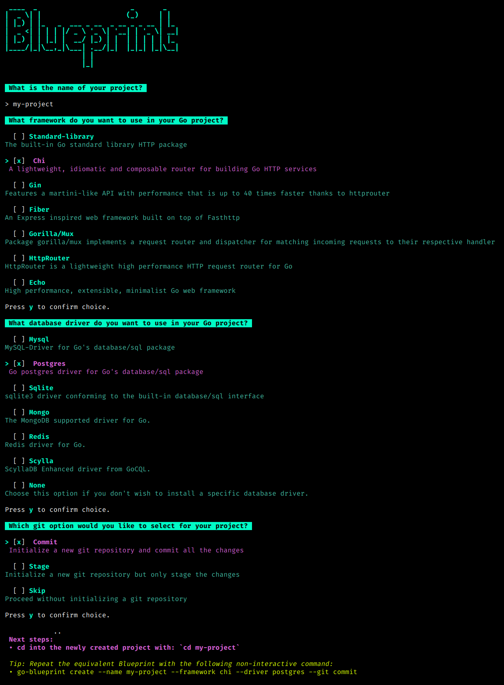
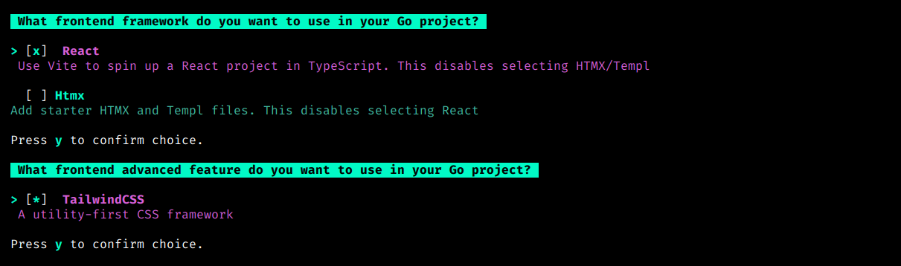
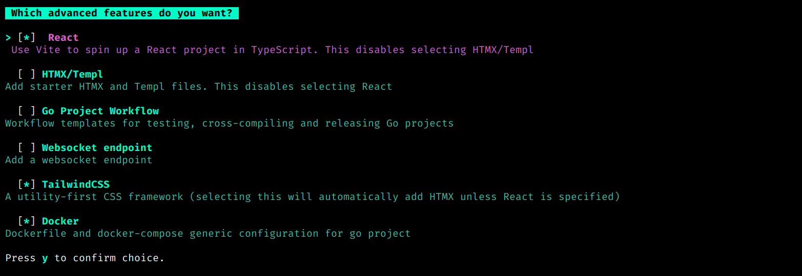

<div style="text-align: center;">
  <h1>
    Introducing the Ultimate Golang Blueprint Library
  </h1>
</div>

Go Blueprint is a CLI tool that allows users to spin up a structured Go project. It also
gives the option to integrate with one of the more popular backend and fronted framewors!

### Why Would I use this?

- Easy to set up and install
- Have the entire Go structure already established
- Setting up a Go HTTP server (or Fasthttp with Fiber)
- Focus on the actual code of your application

## Table of Contents

- [Install](#install)
- [Backend Frameworks](#backends)
- [Database Support](#database-support)
- [Frontend Frameworks](#frontend)
- [Advanced Features](#advanced-features)
- [Blueprint UI](#blueprint-ui)
- [Usage Example](#usage-example)
- [GitHub Stats](#github-stats)
- [License](#license)

<a id="install"></a>

<h2>
  <picture>
    
  </picture>
  Install
</h2>

```bash
go install github.com/melkeydev/go-blueprint@latest
```

This installs a go binary that will automatically bind to your $GOPATH

> if you’re using Zsh, you’ll need to add it manually to `~/.zshrc`.

```bash
GOPATH=$HOME/go  PATH=$PATH:/usr/local/go/bin:$GOPATH/bin
```

don't forget to update

```bash
source ~/.zshrc
```

Then in a new terminal run:

```bash
go-blueprint create
```

You can also use the provided flags to set up a project without interacting with the UI.

```bash
go-blueprint create -n my-project -b gin -d postgres -g commit
```

See `go-blueprint create -h` for all the options and shorthands.

```bash
Usage:
  go-blueprint create [flags]

Flags:
  -a, --advanced                               Get prompts for advanced features
      --feature AdvancedFeatures               Advanced feature to use. Allowed values: githubaction, websocket, docker
  -b, --backend Backend                        Backend to use. Allowed values: chi, gin, fiber, gorilla/mux, standard-library, echo
  -d, --driver Database                        Database drivers to use. Allowed values: mysql, postgres, sqlite, mongo, redis, scylla, none
  -f, --frontend                               Get prompts for frontend frameworks
      --frontend-framework Frontendframework   Frontend framework to use. Allowed values: htmx, react
      --frontend-advanced FrontendAdvanced     Frontend framework advanced features to use. Allowed values: tailwind
  -g, --git Git                                Git to use. Allowed values: commit, stage, skip
  -h, --help                                   help for create
  -n, --name string                            Name of project to create
```

<a id="backends"></a>

<h2>
  <picture>
    
  </picture>
  Backend Frameworks
</h2>

- [Chi](https://github.com/go-chi/chi)
- [Gin](https://github.com/gin-gonic/gin)
- [Fiber](https://github.com/gofiber/fiber)
- [Gorilla/mux](https://github.com/gorilla/mux)
- [Echo](https://github.com/labstack/echo)

<a id="database-support"></a>

<h2>
  <picture>
    
  </picture>
  Database Support
</h2>

Go Blueprint now offers enhanced database support, allowing you to choose your preferred database driver during project setup. Use the `-d ` or --driver flag to specify the database driver you want to integrate into your project.

### Supported Database Drivers

Choose from a variety of supported database drivers:

- [Mysql](https://github.com/go-sql-driver/mysql)
- [Postgres](https://github.com/jackc/pgx/)
- [Sqlite](https://github.com/mattn/go-sqlite3)
- [Mongo](https://go.mongodb.org/mongo-driver)
- [Redis](https://github.com/redis/go-redis)
- [ScyllaDB GoCQL](https://github.com/scylladb/gocql)

<a id="frontend"></a>

<h2>
  <picture>
    
  </picture>
  Frontend Frameworks
</h2>

Frontend frameworks and features can be added to your project using the `-f` flag. This will trigger a prompt to select the desired options.

- [HTMX](https://htmx.org/) support using [Templ](https://templ.guide/)
- [React](https://react.dev/) frontend written in TypeScript, including an example fetch request to the backend

Aditional features is a multi-option prompt; one or more features can be used at the same time (Currently, Tailwind is the only one that is integrated).

- [Tailwind](https://tailwindcss.com/) css framework

<a id="advanced-features"></a>

<h2>
  <picture>
    
  </picture>
  Advanced Features
</h2>

You can now use the `-a` or `--advanced` flag when running the `create` command to get access to the following features: 

- CI/CD workflow setup using [Github Actions](https://docs.github.com/en/actions)
- [Websocket](https://pkg.go.dev/github.com/coder/websocket) sets up a websocket endpoint
- Docker configuration for go project

This is a multi-option prompt; one or more features can be used at the same time.

<a id="blueprint-ui"></a>

<h2>
  <picture>
    
  </picture>
  Blueprint UI
</h2>

Blueprint UI is a web application that allows you to create commands for the CLI and preview the structure of your project. You will be able to see directories and files that will be created upon command execution. Check it out at [go-blueprint.dev](https://go-blueprint.dev)

<a id="usage-example"></a>

<h2>
  <picture>
    
  </picture>
  Usage Example
</h2>

Here's an example of setting up a project with a specific database driver:

```bash
go-blueprint create -n my-project -b gin -d postgres -g commit
```

<p align="center">
  
</p>

Prompts for Frontend frameworks and features can be triggered with the `-f` flag

```bash
go-blueprint create -f
```
or created directly with the `--frontend-framework` and `--frontend-advanced` flags

```bash
go-blueprint create -n my-project -b chi -d none -f --frontend-framework react --frontend-advanced tailwind -g commit
```

<p align="center">
  
</p>

Advanced features are accessible with the `-a` flag

```bash
go-blueprint create -a
```

Advanced features can be enabled using the `--feature` flag along with the `-a` flag.

```bash
go-blueprint create -n my_project -b standard-library -d mongo -a --feature docker --feature websocket -g commit
```

<p align="center">
  
</p>

Frontend and Advanced features can be combined with the `-f` and `-a` flags

```bash
go-blueprint create -af
```

or

```bash
go-blueprint create -n my_project -b fiber -d mysql -f --frontend-framework htmx --frontend-advanced tailwind -a --feature docker --feature githubaction -g commit
```

**Visit [documentation](https://docs.go-blueprint.dev) to learn more about blueprint and its features.**

<a id="github-stats"></a>

<h2>
  <picture>
    
  </picture>
  GitHub Stats
</h2>

<p align="center">
  
</p>

<a id="license"></a>

<h2>
  <picture>
    
  </picture>
  License
</h2>

Licensed under [MIT License](./LICENSE)
