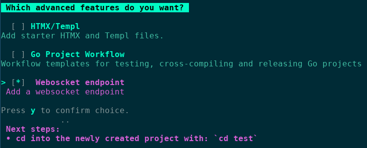

     ____  _                       _       _
    |  _ \| |                     (_)     | |
    | |_) | |_   _  ___ _ __  _ __ _ _ __ | |_
    |  _ <| | | | |/ _ \ '_ \| '__| | '_ \| __|
    | |_) | | |_| |  __/ |_) | |  | | | | | |_
    |____/|_|\__,_|\___| .__/|_|  |_|_| |_|\__|
                        | |
                        |_|

### 🚀 Introducing the Ultimate Golang Blueprint Library 🚀

Go Blueprint is a CLI tool that allows users to spin up a Go project with the corresponding structure seamlessly. It also
gives the option to integrate with one of the more popular Go frameworks (and the list is growing with new features)!

### Why Would I use this?

- Easy to set up and install
- Have the entire Go structure already established
- Setting up a Go HTTP server (or Fasthttp with Fiber)
- Integrate with a popular frameworks
- Focus on the actual code of your application

### Install

```
go install github.com/melkeydev/go-blueprint@latest
```

This installs a go binary that will automatically bind to your $GOPATH

Then in a new terminal run:

```
go-blueprint create
```

You can also use the provided flags to set up a project without interacting with the UI.

```
go-blueprint create --name my-project --framework gin
```

See `go-blueprint create -h` for all the options and shorthands.




### Frameworks Supported

- [Chi](https://github.com/go-chi/chi)
- [Gin](https://github.com/gin-gonic/gin)
- [Fiber](https://github.com/gofiber/fiber)
- [HttpRouter](https://github.com/julienschmidt/httprouter)
- [Gorilla/mux](https://github.com/gorilla/mux)
- [Echo](https://github.com/labstack/echo)

### Database Drivers Supported

- [Mysql](https://github.com/go-sql-driver/mysql)
- [Postgres](https://github.com/lib/pq)
- [Sqlite](https://github.com/mattn/go-sqlite3)
- [Mongo](go.mongodb.org/mongo-driver)

### License

Licensed under [MIT License](./LICENSE)
