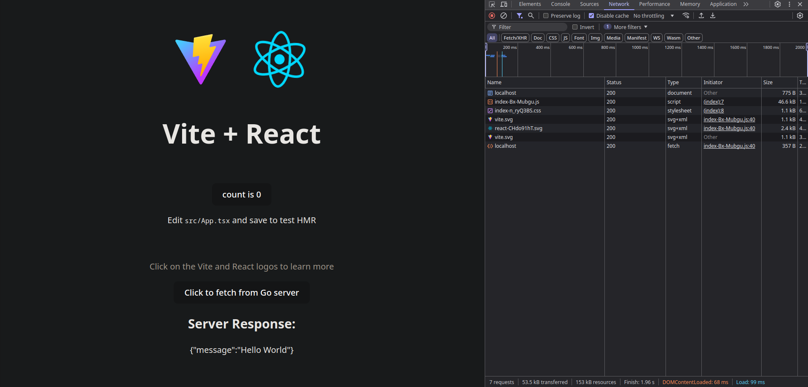

This template provides a minimal setup for getting React working with Vite for the frontend and go on the backend. It allows you to easily integrate React with Tailwind CSS and Vite for fast development.

The React advanced flag can be combined with the Tailwind flag for enhanced styling capabilities.

## Project Structure

```bash
/ (Root)
├── frontend/                     # React advanced flag. Excludes HTMX.
│   ├── node_modules/             # Node dependencies.
│   ├── public/
│   │   ├── index.html
│   │   └── favicon.ico
│   ├── src/                      # React source files.
│   │   ├── App.tsx               # Main React component.
│   │   ├── assets/               # React assets directory
│   │   │   └── logo.svg
│   │   ├── components/           # React components directory.
│   │   │   ├── Header.tsx
│   │   │   └── Footer.tsx
│   │   ├── styles/               # CSS/SCSS styles directory.
│   │   │   └── global.css
│   │   └── index.tsx             # Main entry point for React
│   ├── eslint.config.js          # ESLint configuration file.
│   ├── index.html                # Base HTML template.
│   ├── package.json              # Node.js package configuration.
│   ├── package-lock.json         # Lock file for Node.js dependencies.
│   ├── README.md                 # README file for the React project.
│   ├── tsconfig.app.json         # TypeScript configuration for the app.
│   ├── tsconfig.json             # Root TypeScript configuration.
│   ├── tsconfig.node.json        # TypeScript configuration for Node.js.
│   └── vite.config.ts            # Vite configuration file.
```

## Usage

- **Navigate to the `frontend` directory**:
   First, navigate to the `frontend` directory where the React project resides.

```bash
cd frontend
```

- **Install Dependencies**:
   Use npm to install all necessary dependencies.

```bash
npm install
```

- **Run the Development Server**:
   Start the Vite development server for local development. This will launch a live-reloading server on a default port.

```bash
npm run dev
```

   You should now be able to access the React application by opening a browser and navigating to `http://localhost:5173`.


You can extend the `vite.config.ts` to include additional configurations as needed, such as adding plugins for optimizing the build process, enabling TypeScript support, or configuring Tailwind CSS.

## Makefile

The make run target will start the Go server in the backend, install frontend dependencies, and run the Vite development server for the frontend.

```bash
run:
	@go run cmd/api/main.go &
	@npm install --prefix ./frontend
	@npm run dev --prefix ./frontend
```

After running this command, you can verify the connection between the frontend and backend by checking the console. You can also fetch data from the backend to test the integration.



