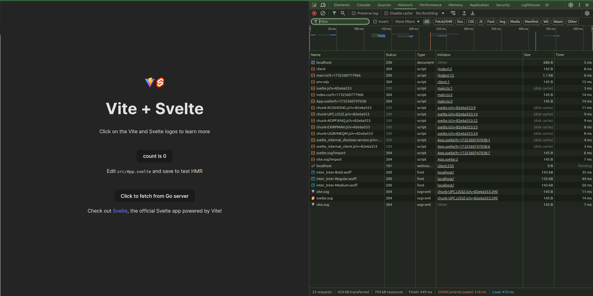

This template provides a minimal setup for getting React working with Vite for the frontend and go on the backend. It allows you to easily integrate React with Tailwind CSS and Vite for fast development.

The Svelte advanced flag can be combined with the Tailwind flag for enhanced styling capabilities.

## Project Structure

```bash
/ (Root)
├── frontend/                     # Svelte advanced flag. Excludes HTMX.
│   ├── node_modules/             # Node dependencies.
│   ├── public/
│   │   └── favicon.ico
│   ├── src/                      # Svelte source files.
│   │   ├── App.svelte            # Main Svelte component.
│   │   ├── app.css               # Main Svelte component.
│   │   ├── assets/               # Svelte assets directory
│   │   │   └── svelte.svg
│   │   ├── lib/                  # Svelte components directory.
│   │   │   ├── Counter.svelte
│   │   └── main.ts               # Main entry point for Svelte
│   ├── index.html                # Base HTML template.
│   ├── package.json              # Node.js package configuration.
│   ├── svelte.config.js          # Svelte app configuration
│   ├── package-lock.json         # Lock file for Node.js dependencies.
│   ├── README.md                 # README file for the React project.
│   ├── tsconfig.json             # Root TypeScript configuration.
│   ├── tsconfig.node.json        # TypeScript configuration for Node.js.
│   └── vite.config.ts            # Vite configuration file.
```

## Usage

- **Navigate to the `frontend` directory**:
  First, navigate to the `frontend` directory where the React project resides.

```bash
cd frontend
```

- **Install Dependencies**:
  Use npm to install all necessary dependencies.

```bash
npm install
```

- **Run the Development Server**:
  Start the Vite development server for local development. This will launch a live-reloading server on a default port.

```bash
npm run dev
```

You should now be able to access the React application by opening a browser and navigating to `http://localhost:5173`.

You can extend the `vite.config.ts` to include additional configurations as needed, such as adding plugins for optimizing the build process, enabling TypeScript support, or configuring Tailwind CSS.

## Makefile

The make run target will start the Go server in the backend, install frontend dependencies, and run the Vite development server for the frontend.

```bash
run:
	@go run cmd/api/main.go &
	@npm install --prefix ./frontend
	@npm run dev --prefix ./frontend
```

After running this command, you can verify the connection between the frontend and backend by checking the console. You can also fetch data from the backend to test the integration.



## Dockerfile

Combine svelte advanced flag with Docker flag to get Docker and docker-compose configuration and run them with:

```bash
make docker-run
```

### Dockerfile

```dockerfile
FROM golang:1.23-alpine AS build

WORKDIR /app

COPY go.mod go.sum ./
RUN go mod download

COPY . .

RUN go build -o main cmd/api/main.go

FROM alpine:3.20.1 AS prod
WORKDIR /app
COPY --from=build /app/main /app/main
EXPOSE ${PORT}
CMD ["./main"]


FROM node:20 AS frontend_builder
WORKDIR /frontend

COPY frontend/package*.json ./
RUN npm install
COPY frontend/. .
RUN npm run build

FROM node:20-slim AS frontend
RUN npm install -g serve
COPY --from=frontend_builder /frontend/dist /app/dist
EXPOSE 5173
CMD ["serve", "-s", "/app/dist", "-l", "5173"]
```

### Docker compose without db

```yaml
services:
  app:
    build:
      context: .
      dockerfile: Dockerfile
      target: prod
    restart: unless-stopped
    ports:
      - ${PORT}:${PORT}
    environment:
      APP_ENV: ${APP_ENV}
      PORT: ${PORT}
  frontend:
    build:
      context: .
      dockerfile: Dockerfile
      target: frontend
    restart: unless-stopped
    ports:
      - 5173:5173
    depends_on:
      - app
```

### Docker compose with db

```yaml
services:
  app:
    build:
      context: .
      dockerfile: Dockerfile
      target: prod
    restart: unless-stopped
    ports:
      - ${PORT}:${PORT}
    environment:
      APP_ENV: ${APP_ENV}
      PORT: ${PORT}
      BLUEPRINT_DB_HOST: ${BLUEPRINT_DB_HOST}
      BLUEPRINT_DB_PORT: ${BLUEPRINT_DB_PORT}
      BLUEPRINT_DB_DATABASE: ${BLUEPRINT_DB_DATABASE}
      BLUEPRINT_DB_USERNAME: ${BLUEPRINT_DB_USERNAME}
      BLUEPRINT_DB_PASSWORD: ${BLUEPRINT_DB_PASSWORD}
      BLUEPRINT_DB_SCHEMA: ${BLUEPRINT_DB_SCHEMA}
    depends_on:
      psql_bp:
        condition: service_healthy
    networks:
      - blueprint
  frontend:
    build:
      context: .
      dockerfile: Dockerfile
      target: frontend
    restart: unless-stopped
    depends_on:
      - app
    ports:
      - 5173:5173
    networks:
      - blueprint
  psql_bp:
    image: postgres:latest
    restart: unless-stopped
    environment:
      POSTGRES_DB: ${BLUEPRINT_DB_DATABASE}
      POSTGRES_USER: ${BLUEPRINT_DB_USERNAME}
      POSTGRES_PASSWORD: ${BLUEPRINT_DB_PASSWORD}
    ports:
      - '${BLUEPRINT_DB_PORT}:5432'
    volumes:
      - psql_volume_bp:/var/lib/postgresql/data
    healthcheck:
      test:
        [
          'CMD-SHELL',
          "sh -c 'pg_isready -U ${BLUEPRINT_DB_USERNAME} -d ${BLUEPRINT_DB_DATABASE}'"
        ]
      interval: 5s
      timeout: 5s
      retries: 3
      start_period: 15s
    networks:
      - blueprint

volumes:
  psql_volume_bp:
networks:
  blueprint:
```
