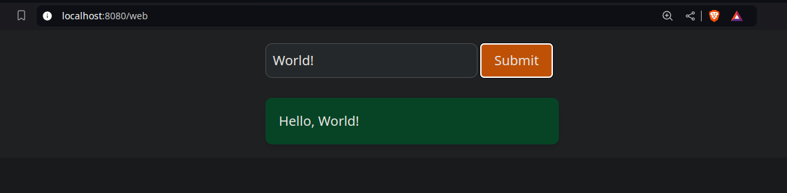

Tailwind is closely coupled with the advanced HTMX flag, and HTMX will be automatically used if you select Tailwind in your project.

We do not introduce outside dependencies automatically, and you need compile output.css (file is empty by default) with the Tailwind CLI tool.

The project tree would look like this:
```bash
/ (Root)
├── cmd/
│   ├── api/
│   │   └── main.go
│   └── web/
│       ├── styles/
│       │   └── input.css
│       ├── assets/
│       │   ├── css/
│       │   │   └── output.css
│       │   └── js/
│       │       └── htmx.min.js
│       ├── base.templ
│       ├── base_templ.go
│       ├── efs.go
│       ├── hello.go
│       ├── hello.templ
│       └── hello_templ.go
├── internal/
│   └── server/
│       ├── routes.go
│       ├── routes_test.go
│       └── server.go
├── go.mod
├── go.sum
├── Makefile
├── README.md
└── tailwind.config.js
```

## Standalone Tailwind CLI

The The idea is to avoid using Node.js and npm to build output.css.

The Makefile will have entries for downloading and compiling CSS. It will automatically detect the OS and download the latest release from the [official repository](https://github.com/tailwindlabs/tailwindcss/releases).

## Linux Makefile Example
```bash
all: build
templ-install:
	@if ! command -v templ > /dev/null; then \
		read -p "Go's 'templ' is not installed on your machine. Do you want to install it? [Y/n] " choice; \
		if [ "$$choice" != "n" ] && [ "$$choice" != "N" ]; then \
			go install github.com/a-h/templ/cmd/templ@latest; \
			if [ ! -x "$$(command -v templ)" ]; then \
				echo "templ installation failed. Exiting..."; \
				exit 1; \
			fi; \
		else \
			echo "You chose not to install templ. Exiting..."; \
			exit 1; \
		fi; \
	fi

tailwind-install:
	@if [ ! -f tailwindcss ]; then curl -sL https://github.com/tailwindlabs/tailwindcss/releases/latest/download/tailwindcss-linux-x64 -o tailwindcss; fi
	@chmod +x tailwindcss

build: tailwind-install templ-install
	@echo "Building..."
	@templ generate
	@./tailwindcss -i cmd/web/styles/input.css -o cmd/web/assets/css/output.css
	@go build -o main cmd/api/main.go
```

## Use Tailwind CSS in your project

By default, simple CSS examples are included in the codebase.
Update base.templ and hello.templ, then rerun templ generate to see the changes at the `localhost:PORT/web` endpoint.




