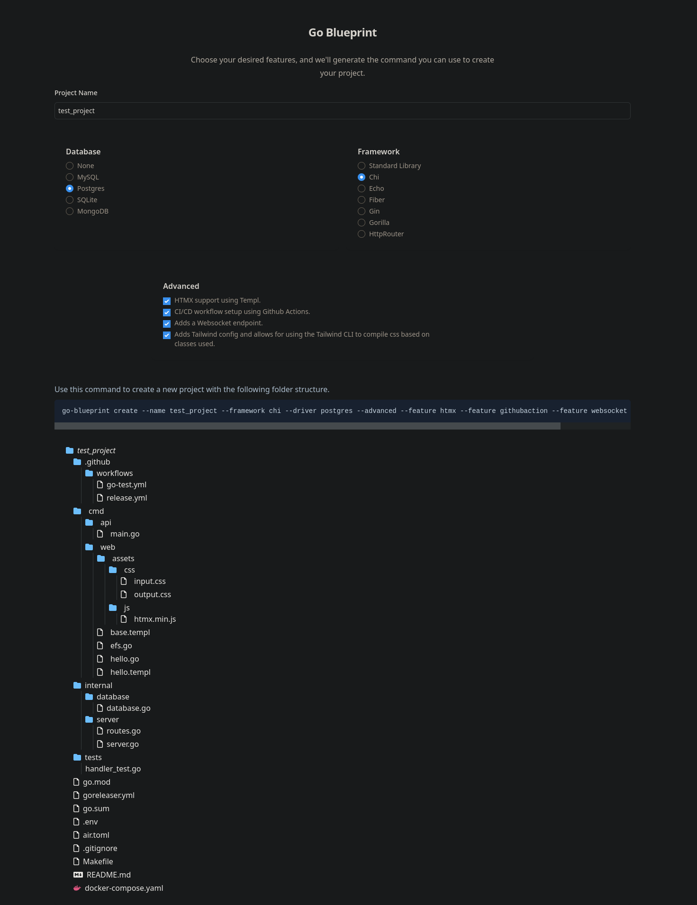

The Blueprint UI is a crucial component of the Go Blueprint ecosystem, providing a user-friendly interface for creating CLI commands and visualizing project structures.

By visiting the Blueprint UI website at [go-blueprint.dev](https://go-blueprint.dev), users can interact with a visual representation of their project setup before executing commands.

This enhances the overall experience of using Go Blueprint by providing a visual representation of project setups and simplifying the command generation process. Check Blueprint UI [code](https://github.com/briancbarrow/go-blueprint-htmx).
