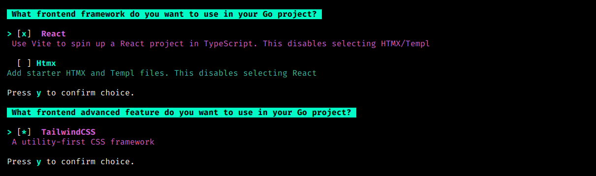

## Creating a Project

After installing the Go-Blueprint CLI tool, you can create a new project with the default settings by running the following command:

```bash
go-blueprint create
```

This command will interactively guide you through the project setup process, allowing you to choose the project name, backend, and database driver.


## Using Flags for Non-Interactive Setup

For a non-interactive setup, you can use flags to provide the necessary information during project creation. Here's an example:

```
go-blueprint create -n my-project -b chi -d postgres -g commit
```

In this example:

- `-n` or  `--name`: Specifies the name of the project (replace "my-project" with your desired project name).
- `-b` or `--backend-framework`: Specifies the Go backend to be used (e.g., "gin").
- `-d` or `--driver`: Specifies the database driver to be integrated (e.g., "postgres").
- `-g` or `--git`: Specifies the git configuration option of the project (e.g., "commit").

Customize the flags according to your project requirements.

## Frontend Frameworks and Features

To include frontend frameworks and features in your project, you can use the `-f` flag to trigger the prompt:

```bash
go-blueprint create -f
```



## Advanced Flag

By including the `-a` or `--advanced` flag, users can choose one or all of the advanced features, GitHub Actions for CI/CD, Websocket and Docker, during the project creation process. The flag enhances the simplicity of Blueprint while offering flexibility for users who require additional functionality.

```bash
go-blueprint create -a
```


## Combining Flags

Frontend and Advanced features can be combined with the `-f` and `-a` flags

```bash
go-blueprint create -af
```

or

```bash
go-blueprint create -n my_project -b fiber -d mysql -f --frontend-framework htmx --frontend-advanced tailwind -a --feature docker --feature githubaction -g commit
```
