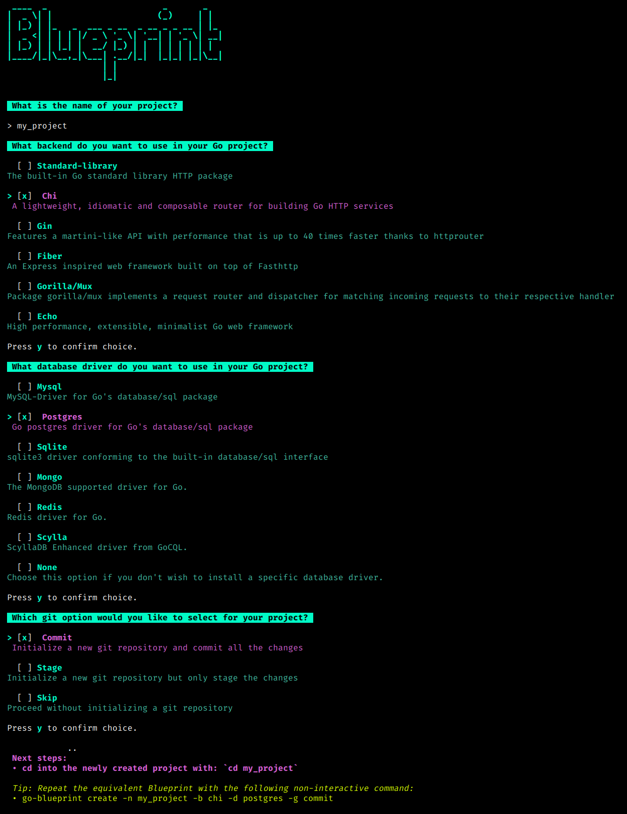
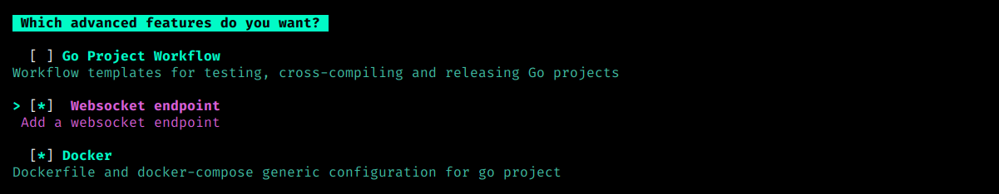

## Creating a Project

After installing the Go-Blueprint CLI tool, you can create a new project with the default settings by running the following command:

```bash
go-blueprint create
```

This command will interactively guide you through the project setup process, allowing you to choose the project name, framework, and database driver.



## Using Flags for Non-Interactive Setup

For a non-interactive setup, you can use flags to provide the necessary information during project creation. Here's an example:

```
go-blueprint create --name my-project --framework gin --driver postgres
```

In this example:

- `--name`: Specifies the name of the project (replace "my-project" with your desired project name).
- `--framework`: Specifies the Go framework to be used (e.g., "gin").
- `--driver`: Specifies the database driver to be integrated (e.g., "postgres").

Customize the flags according to your project requirements.

## Advanced Flag

By including the `--advanced` flag, users can choose one or all of the advanced features, HTMX, GitHub Actions for CI/CD and Websocket support, during the project creation process. The flag enhances the simplicity of Blueprint while offering flexibility for users who require additional functionality.

```bash
go-blueprint create --advanced
```

To recreate the project using the same configuration semi-interactively, use the following command:
```bash
go-blueprint create --name my-project --framework chi --driver mysql --advanced
```
This approach opens interactive mode only for advanced features, which allow you to choose the one or combination of available features.



## Non-Interactive Setup

Advanced features can be enabled using the `--feature` flag along with the `--advanced` flag:

For HTMX:
```bash
go-blueprint create --advanced --feature htmx
```

For the CI/CD workflow:
```bash
go-blueprint create --advanced --feature githubaction
```

For the websocket:
```bash
go-blueprint create --advanced --feature websocket
```

Or all features at once:
```bash
go-blueprint create --name my-project --framework chi --driver mysql --advanced --feature htmx --feature githubaction --feature websocket
```