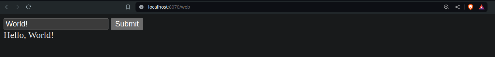

To test the /web endpoint when HTMX and Temp are used, you can simply open it in a web browser. This endpoint serves an HTML page with a form.

Navigate to `http://localhost:PORT/web`

This page contains a form with a single input field and a submit button. Upon submitting the form, "Hello, [input]" will be displayed.

## Sample output



## Terminal log

```bash
make run
2024/05/28 20:42:06 "POST http://localhost:8070/hello HTTP/1.1" from 127.0.0.1:45494 - 200 24B in 53.23µs
```
