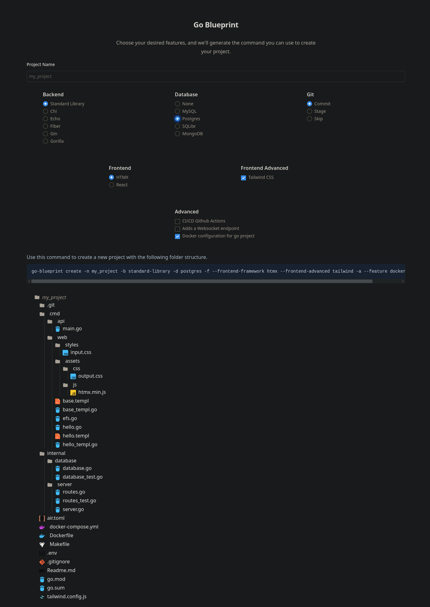

---
hide:
  - toc
---
## Go Blueprint - Ultimate Golang Blueprint Library


Powerful CLI tool designed to streamline the process of creating Go projects with a robust and standardized structure. Not only does Go Blueprint facilitate project initialization, but it also offers seamless integration with popular Go backends, frontend frameworks, allowing you to focus on your application's code from the very beginning.

## Why Choose Go Blueprint?

- **Easy Setup and Installation**: Go Blueprint simplifies the setup process, making it a breeze to install and get started with your Go projects.

- **Pre-established Go Project Structure**: Save time and effort by having the entire Go project structure set up automatically. No need to worry about directory layouts or configuration files.

- **HTTP Server Configuration Made Easy**: Whether you prefer Go's standard library HTTP package, Chi, Gin, Fiber, Gorilla/mux or Echo, Go Blueprint caters to your server setup needs.

- **Focus on Your Application Code**: With Go Blueprint handling the project scaffolding, you can dedicate more time and energy to developing your application logic.

## Project Structure

By visiting the Blueprint UI website at [go-blueprint.dev](https://go.blueprint.dev), you can interact with a visual representation of the project setup before executing commands. It provides a user-friendly interface for creating CLI commands and visualizing project structures.



Execute go-blueprint create -h to see all the options and shorthands

```bash
Usage:
  go-blueprint create [flags]

Flags:
  -a, --advanced                               Get prompts for advanced features
      --feature AdvancedFeatures               Advanced feature to use. Allowed values: githubaction, websocket, docker
  -b, --backend Backend                        Backend to use. Allowed values: chi, gin, fiber, gorilla/mux, standard-library, echo
  -d, --driver Database                        Database drivers to use. Allowed values: mysql, postgres, sqlite, mongo, redis, scylla, none
  -f, --frontend                               Get prompts for frontend frameworks
      --frontend-framework Frontendframework   Frontend framework to use. Allowed values: htmx, react
      --frontend-advanced FrontendAdvanced     Frontend framework advanced features to use. Allowed values: tailwind
  -g, --git Git                                Git to use. Allowed values: commit, stage, skip
  -h, --help                                   help for create
  -n, --name string                            Name of project to create
```
